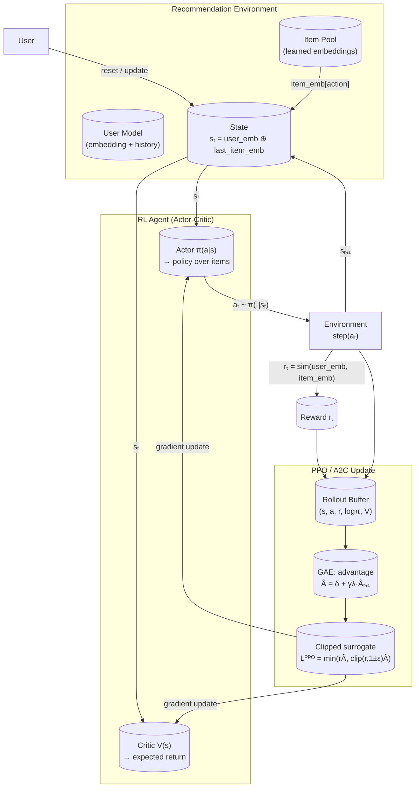

# RecSys_RL

Reinforcement Learning for Recommender Systems — PPO & A2C from scratch.



## Overview

A recommender system cast as a Markov Decision Process:

| Component     | This project                                              |
| ------------- | --------------------------------------------------------- |
| **State**     | User embedding ⊕ last recommended item embedding (64-dim) |
| **Action**    | Select one item from the candidate pool (discrete)        |
| **Reward**    | Dot-product similarity between user and item embeddings   |
| **Agent**     | Actor-critic neural network                               |
| **Algorithm** | PPO (clipped surrogate + GAE) or A2C (N-step)             |

## Quickstart

```bash
pip install numpy torch
python -m train --algo ppo --total-timesteps 100000
python -m evaluate --algo ppo --checkpoint checkpoints/ppo.pt
```

## Project Layout

```
├── config.py           # Hyperparameter dataclasses (Env / PPO / A2C / Train)
├── env/                # RecEnv (gym-like) + UserModel
├── agents/             # PPO + A2C algorithm implementations
├── models/             # Actor & Critic neural networks
├── data/               # Dataset loader stubs
├── utils/              # Logger (stdout + CSV) + metrics
├── train.py            # Training entrypoint
├── evaluate.py         # Evaluation entrypoint
└── docs/               # Theory, math, and deep-dive explanations
```

## Docs

| Document                                                   | What it covers                                               |
| ---------------------------------------------------------- | ------------------------------------------------------------ |
| [docs/01_intro_recsys.md](docs/01_intro_recsys.md)         | How TikTok, YouTube, & social media RecSys actually work     |
| [docs/02_rl_formulation.md](docs/02_rl_formulation.md)     | MDP formulation: state, action, reward design                |
| [docs/03_theory_ppo.md](docs/03_theory_ppo.md)             | PPO theory and full math derivation                          |
| [docs/04_theory_a2c.md](docs/04_theory_a2c.md)             | A2C theory and math                                          |
| [docs/05_code_walkthrough.md](docs/05_code_walkthrough.md) | Line-by-line explanation of this codebase                    |
| [docs/06_imitation_agents.md](docs/06_imitation_agents.md) | Imitation agents inspired by TikTok, YouTube, & social feeds |
| [docs/07_extensions.md](docs/07_extensions.md)             | Scaling ideas: Transformers, multi-stage, exploration        |

## Config

| Config class  | Key fields                                            |
| ------------- | ----------------------------------------------------- |
| `EnvConfig`   | num_items, state_dim, max_episode_steps, reward_decay |
| `PPOConfig`   | lr, clip_eps, gae_lambda, update_epochs, batch_size   |
| `A2CConfig`   | lr, n_steps, ent_coef                                 |
| `TrainConfig` | total_timesteps, log_interval, seed                   |
